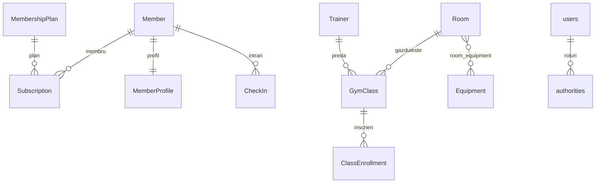

# Sistem de Management Sala de Fitness

Aplicatie web pentru gestionarea unei sali de fitness: membri, abonamente, antrenori, clase de grup, inscrieri si check-in.

Arhitectura de **microservicii** (migrata dintr-un monolit Spring Boot): configurare centralizata, service discovery si comunicare inter-servicii prin REST (OpenFeign).

## Stack Tehnologic

| Strat | Tehnologie |
|-------|------------|
| Baza de date | MySQL 8 (cate o schema per serviciu) |
| Backend | Java 21, Spring Boot 3.3, Spring Data JPA, Flyway, Spring Security |
| Cloud / Microservicii | Spring Cloud Config, Netflix Eureka, OpenFeign, Spring Cloud Gateway |
| Reziliență | Resilience4j (Circuit Breaker + Retry) |
| Securitate | Spring Security (sesiune + BCrypt), JWT HS256 (jjwt) inter-servicii |
| Observabilitate | Spring Boot Actuator, Micrometer + Prometheus, Grafana, Zipkin (tracing) |
| Frontend | React 18 + Vite |
| Documentatie API | springdoc-openapi (Swagger UI) |
| Infrastructura locala | Docker Compose |

## Arhitectura

```text
   Frontend (React/Vite :5173) ──proxy──► ┌─────────────┐  :8080
                                          │ api-gateway │  (routing, rate limit, filtre)
                                          └──────┬──────┘
                       ┌──────────────────┐      │
                       │  config-server   │      │ lb:// (prin Eureka)
                       │      :8888       │      │
                       └────────┬─────────┘      │
                                │ configuratii   │
              ┌─────────────────┼────────────────┼┐
              ▼                 ▼                 ▼▼
      ┌──────────────┐  ┌──────────────┐  ┌─────────────────────┐
      │ user-service │  │ gym-service  │  │ notification-service│
      │    :8081     │  │    :8082     │  │       :8083         │
      └──────┬───────┘  └──────┬───────┘  └──────────┬──────────┘
             │  Feign ↔ Feign  │      Feign (rapoarte)│
             └────────┬────────┴──────────────────────┘
                      ▼
              ┌──────────────┐
              │ eureka-server│  :8761  (Service Discovery)
              └──────────────┘

   Observabilitate:  Prometheus :9090  ──►  Grafana :3000     |     Zipkin :9411 (tracing)
        ▲ scrape /actuator/prometheus pe toate serviciile
```

## Componente

| Componenta | Port | Rol |
|------------|------|-----|
| api-gateway | 8080 | Spring Cloud Gateway — punct unic de intrare: routing centralizat, rate limiting, request/response filtering |
| config-server | 8888 | Spring Cloud Config Server — serveste configuratiile tuturor serviciilor |
| eureka-server | 8761 | Netflix Eureka — service registry, descoperire automata |
| user-service | 8081 | Autentificare (Spring Security JDBC), membri, profiluri, planuri, abonamente |
| gym-service | 8082 | Antrenori, sali, echipament, clase, inscrieri, check-in |
| notification-service | 8083 | Rapoarte agregate (apeluri Feign catre user-service + gym-service) |
| frontend | 5173 | UI React; proxy Vite ruteaza catre api-gateway (:8080) |
| prometheus | 9090 | Colectare metrici (scrape `/actuator/prometheus` pentru toate serviciile) |
| grafana | 3000 | Dashboard metrici (CPU, memorie, requests) — datasource si dashboard provizionate |
| zipkin | 9411 | Distributed tracing (Micrometer Tracing + Brave) |

## Structura Proiect

```text
fitness-gym-system/
├── api-gateway/            # Spring Cloud Gateway (:8080) — routing, rate limit, filtre
├── config-server/          # Spring Cloud Config (:8888)
│   └── config-repo/        # config per serviciu (editabil live)
├── eureka-server/          # Eureka Discovery (:8761)
├── user-service/           # :8081  — securitate + membri/abonamente
├── gym-service/            # :8082  — clase/traineri/sali/check-in
├── notification-service/   # :8083  — rapoarte (Feign)
├── monitoring/             # prometheus.yml + provisioning Grafana (datasource + dashboard)
├── frontend/               # React + Vite (:5173)
├── backend/                # monolitul original (referinta)
└── docker-compose.yml
```

## Configurare Centralizata (Spring Cloud Config)

- `config-server` serveste configuratiile din `config-server/src/main/resources/config/`.
- Fiecare serviciu citeste la startup: `spring.config.import: configserver:http://localhost:8888`.
- Externalizate: port, URL/credentiale baza de date, URL Eureka, cheie remember-me.
- Verificare: `http://localhost:8888/user-service/default`, `http://localhost:8888/gym-service/default`.

## Service Discovery si Comunicare (Eureka + Feign)

- Toate serviciile se inregistreaza automat in Eureka (`http://localhost:8761`).
- **Comunicare inter-servicii prin REST (OpenFeign):**
  - `user-service → gym-service`: creare antrenor la inregistrare, creare clasa (trainer), inscriere la clasa.
  - `gym-service → user-service`: validare membru la inscriere / check-in (`/api/internal/members/{id}`).
  - `notification-service → user-service + gym-service`: agregare date pentru rapoarte.
- Endpoint-uri interne (`/api/internal/**`) — dedicate apelurilor inter-servicii, protejate cu **JWT de serviciu** (vezi *Securitate Distribuita*).

## API Gateway (Spring Cloud Gateway, :8080)

Punct unic de intrare pentru tot traficul dinspre frontend. Frontend-ul (`vite.config.js`) ruteaza `/api`, `/login`, `/logout` catre `http://localhost:8080`.

- **Routing centralizat** — rute definite in `api-gateway/src/main/resources/application.yml`, cu `lb://` (load-balanced prin Eureka):
  - `/api/members/**`, `/api/membership-plans/**`, `/api/subscriptions/**`, `/api/auth/**`, `/login`, `/logout` → `user-service`
  - `/api/trainers/**`, `/api/rooms/**`, `/api/gym-classes/**`, `/api/class-enrollments/**`, `/api/check-ins/**`, `/api/equipment/**` → `gym-service`
  - `/api/reports/**` → `notification-service`
- **Rate limiting** — `RateLimitingFilter` (GlobalFilter, in-memory, per IP client, fereastra fixa). Implicit `30` cereri / `10s` (`gateway.rate-limit.*`); peste limita raspunde `429 Too Many Requests` cu antetele `X-RateLimit-Limit` / `X-RateLimit-Remaining` / `Retry-After`.
- **Request/Response filtering** — `LoggingFilter` (GlobalFilter): injecteaza `X-Gateway-Request-Id` pe request-ul catre servicii si adauga `X-Gateway` + `X-Response-Time-Ms` pe raspuns, logand metoda/calea/latenta.

## Monitorizare si Metrici (Actuator + Prometheus + Grafana)

- **Actuator** — toate serviciile expun `/actuator/health`, `/actuator/metrics`, `/actuator/prometheus` (`management.endpoints.web.exposure.include` in `config-repo/application.yml`).
- **Prometheus** (`:9090`) — scrape la `/actuator/prometheus` pentru cele 6 servicii (config in `monitoring/prometheus/prometheus.yml`, tinte prin `host.docker.internal`).
- **Grafana** (`:3000`, `admin`/`admin`) — datasource Prometheus + dashboard *„Fitness Gym - Microservices Overview”* provizionate automat (`monitoring/grafana/provisioning/`): CPU, memorie JVM, rata de request-uri, erori 5xx, stare servicii.
- **Health checks** — `up` per serviciu in Prometheus + `/actuator/health` (detalii complete) pe fiecare componenta.
- **Distributed tracing (bonus)** — Micrometer Tracing + Brave, export catre **Zipkin** (`:9411`). Sampling 100% (`management.tracing.sampling.probability: 1.0`); trace-urile se propaga prin gateway catre servicii si in apelurile Feign.

### Pornire stack monitorizare (Docker)

```bash
docker compose up -d prometheus grafana zipkin
```

- Prometheus targets: `http://localhost:9090/targets`
- Grafana dashboard: `http://localhost:3000` → *Fitness Gym - Microservices Overview*
- Zipkin: `http://localhost:9411`

## Baza de Date (Flyway, schema per serviciu)

| Serviciu | Schema | Migrari |
|----------|--------|---------|
| user-service | `user_service_db` | V1 schema, V2 securitate (`users`/`authorities`/`persistent_logins`), V3 seed |
| gym-service | `gym_service_db` | V1 schema (fara FK cross-service), V2 seed |

> Referintele cross-service (ex. `member_id` in `class_enrollment`/`check_in`) sunt stocate ca `Long` simplu, fara FK intre scheme — granita corecta intre microservicii.

## Model ERD



Relatii JPA:
- `@OneToOne`: `Member` ↔ `MemberProfile` (user-service).
- `@OneToMany`/`@ManyToOne`: `Member`/`MembershipPlan` → `Subscription` (user-service); `Trainer`/`Room` → `GymClass`, `GymClass` → `ClassEnrollment` (gym-service).
- `@ManyToMany`: `Room` ↔ `Equipment` prin `room_equipment` (gym-service).

## Securitate (Spring Security — user-service)

- Autentificare **JDBC** (`JdbcUserDetailsManager`), parole **BCrypt**.
- Roluri: `ROLE_USER`, `ROLE_ADMIN` (`admin` are ambele; `user` doar `ROLE_USER`).
- Autorizare `/api/**`: **GET** → USER sau ADMIN; **POST/PUT/DELETE** → doar ADMIN.
- `/api/internal/**` → necesita **JWT de serviciu** (`ROLE_SERVICE`) — vezi sectiunea de mai jos.
- Login form (`/login`), logout, remember-me persistent, CSRF (cookie `XSRF-TOKEN`).
- Conturi demo: `admin` / `Admin123!`, `user` / `User123!`.

## Securitate Distribuita (JWT inter-servicii)

Autentificare **JWT între microservicii** pentru apelurile interne (`/api/internal/**`), separat de sesiunea utilizatorului.

- **Semnare (callers)** — `gym-service` si `notification-service` semneaza un JWT **HS256** (subiect = numele serviciului, issuer + expirare scurta) cu un secret partajat prin config-server (`internal.jwt.secret`). Un `RequestInterceptor` Feign (`FeignAuthInterceptor`) ataseaza automat `Authorization: Bearer <jwt>` pe fiecare apel inter-servicii.
- **Validare (user-service)** — `InternalJwtAuthenticationFilter` verifica semnatura, issuer-ul si expirarea; la token valid autentifica apelantul ca `ROLE_SERVICE`. Endpoint-urile `/api/internal/**` cer `hasRole("SERVICE")`.
- **Rezultat** — apel intern fara token sau cu token invalid → `401`; apel inter-servicii legitim (semnat) → `200`. Login-ul utilizatorului (sesiune + cookie) ramane neschimbat.

```text
gym-service / notification-service          user-service
   │  semneaza JWT HS256 (secret partajat)      │
   │  Authorization: Bearer <jwt>  ───────────► │  InternalJwtAuthenticationFilter
   │      (Feign RequestInterceptor)            │  valideaza → ROLE_SERVICE → /api/internal/**
```

> Secretul este externalizat in `config-repo/application.yml` (`internal.jwt.secret`) — partajat de toate serviciile prin config-server.

## API REST

| Resursa | Serviciu | Path |
|---------|----------|------|
| Membri | user-service | `/api/members` |
| Profil membru (1:1) | user-service | `/api/member-profiles` |
| Planuri abonament | user-service | `/api/membership-plans` |
| Abonamente | user-service | `/api/subscriptions` |
| Autentificare / cont | user-service | `/api/auth/**` |
| Antrenori | gym-service | `/api/trainers` |
| Echipament | gym-service | `/api/equipment` |
| Sali (M:N echipament) | gym-service | `/api/rooms` |
| Clase | gym-service | `/api/gym-classes` |
| Inscrieri la clasa | gym-service | `/api/class-enrollments` |
| Check-in | gym-service | `/api/check-ins` |
| Rapoarte agregate | notification-service | `/api/reports/{members,subscriptions,classes,check-ins}` |

`DELETE /api/members/{id}` — dezactivare logica (`is_active = false`).

## Rulare Locala

### 1) Baza de date (MySQL pe 3306)

Creeaza schemele si userul:

```sql
CREATE DATABASE user_service_db;
CREATE DATABASE gym_service_db;
CREATE USER 'gym_user'@'localhost' IDENTIFIED BY 'gym_pass';
GRANT ALL PRIVILEGES ON user_service_db.* TO 'gym_user'@'localhost';
GRANT ALL PRIVILEGES ON gym_service_db.* TO 'gym_user'@'localhost';
FLUSH PRIVILEGES;
```

### 2) Pornire servicii (in aceasta ordine)

```text
1. config-server         (:8888)
2. eureka-server         (:8761)
3. user-service          (:8081)
4. gym-service           (:8082)
5. notification-service  (:8083)
6. api-gateway           (:8080)
```

Fiecare: ruleaza clasa `*Application` din IntelliJ. Flyway aplica migrarile la startup.
Optional (monitorizare): `docker compose up -d prometheus grafana zipkin`.

### 3) Frontend

```bash
cd frontend
npm install
npm run dev
```

Deschide `http://localhost:5173` si autentifica-te cu `admin` / `Admin123!`.

## Verificare

- Eureka dashboard: `http://localhost:8761` — trebuie sa apara API-GATEWAY, USER-SERVICE, GYM-SERVICE, NOTIFICATION-SERVICE.
- Config server: `http://localhost:8888/user-service/default`.
- Gateway (routing): `http://localhost:8080/api/gym-classes`, `http://localhost:8080/api/reports/members`.
- Gateway (rate limiting): peste 30 cereri / 10s catre `http://localhost:8080/api/gym-classes` → `429`.
- Prometheus: `http://localhost:9090/targets` — toate cele 6 servicii `UP`.
- Grafana: `http://localhost:3000` (admin/admin) → dashboard *Fitness Gym - Microservices Overview*.
- Zipkin: `http://localhost:9411` — trace-uri pentru api-gateway, user-service, gym-service.

## Note despre alternativa Docker

`docker-compose.yml` porneste intregul stack (MySQL + cele 5 servicii) acolo unde virtualizarea este disponibila. Pe masinile fara suport de virtualizare, foloseste MySQL instalat local + pornirea serviciilor din IDE (vezi mai sus).
