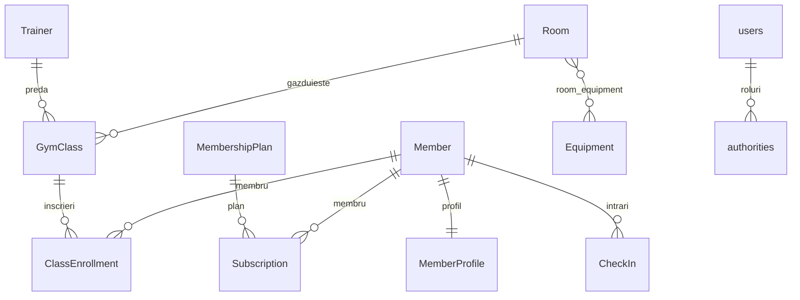

# Sistem de Management Sala de Fitness

Aplicatie web pentru gestionarea unei sali de fitness: membri, abonamente, antrenori, clase de grup, inscrieri si check-in.

Backend Spring Boot cu JPA (relatii complete), CRUD REST pentru toate entitatile domeniu, Spring Security (JDBC, roluri USER/ADMIN), pagina de login Thymeleaf, Swagger/OpenAPI.

## Stack Tehnologic

| Strat | Tehnologie |
|-------|------------|
| Baza de date | MySQL 8 |
| Backend | Java 21, Spring Boot, Spring Data JPA, Flyway, Spring Security, Thymeleaf |
| Documentatie API | springdoc-openapi (Swagger UI) |
| Infrastructura locala | Docker Compose |

Flux local:

`Browser -> Login (Thymeleaf/React) / Swagger UI -> REST API (Spring Boot) -> Service -> Repository -> MySQL`

## Structura Proiect

```text
fitness-gym-system/
├── backend/
│   ├── pom.xml
│   └── src/main/
│       ├── java/com/fitness/gym/
│       │   ├── config/
│       │   ├── controller/
│       │   ├── dto/
│       │   ├── entity/
│       │   ├── exception/
│       │   ├── repository/
│       │   └── service/
│       └── resources/
│           ├── application.yml
│           ├── static/css/
│           ├── templates/
│           └── db/migration/
│               ├── V1__schema.sql
│               ├── V2__seed.sql
│               └── V3__security_and_extensions.sql
└── docker-compose.yml
```

## Baza de Date (Flyway)

- [V1__schema.sql](backend/src/main/resources/db/migration/V1__schema.sql) — tabele domeniu + constrangeri.
- [V2__seed.sql](backend/src/main/resources/db/migration/V2__seed.sql) — date de demo.
- [V3__security_and_extensions.sql](backend/src/main/resources/db/migration/V3__security_and_extensions.sql) — utilizatori/roluri Spring Security (`users`, `authorities`), `persistent_logins` (remember-me), `member_profile` (1:1 cu `member`), `equipment` si `room_equipment` (M:N sala–echipament).

## Model ERD (JPA + schema)



Relatii JPA (cerinte Lab2):

- `@OneToOne`: `Member` ↔ `MemberProfile` (cheie `member_id`).
- `@OneToMany` / `@ManyToOne`: ex. `Member` → `Subscription`, `MembershipPlan` → `Subscription`, `Trainer`/`Room` → `GymClass`, `GymClass` → `ClassEnrollment`, `Member` → `CheckIn`.
- `@ManyToMany`: `Room` ↔ `Equipment` prin tabelul `room_equipment` (`@JoinTable` pe `Room`).

## Securitate (Spring Security)

- Autentificare **JDBC** (`JdbcUserDetailsManager`), parole **BCrypt** in tabelul `users`.
- Roluri in `authorities`: `ROLE_USER`, `ROLE_ADMIN` (utilizatorul `admin` are ambele; `user` doar `ROLE_USER`).
- **Autorizare**: toate rutele `/api/**` necesita autentificare. **GET** `/api/**` — `USER` sau `ADMIN`. **POST, PUT, DELETE** `/api/**` — doar `ADMIN`.
- **Swagger UI** si **OpenAPI** (`/swagger-ui/**`, `/v3/api-docs/**`) — acelasi model (citire pentru USER+ADMIN; in Swagger, operatiunile de scriere necesita `ADMIN`).
- **Login** custom: `/login` (Thymeleaf), **logout** POST la `/logout`, **remember-me** persistent (tabel `persistent_logins`), **CSRF** activ (cookie `XSRF-TOKEN` vizibil pentru clienti web; Swagger are suport CSRF activat prin configuratie).
- Conturi demo (dupa migrare): `admin` / `Admin123!`, `user` / `User123!`.

Pagina principala: `/` sau `/home` (link catre login si, dupa autentificare, Swagger).

## API REST (CRUD)

Prefix comun: `/api`. Toate resursele suporta `GET` (list + by id), `POST`, `PUT`, `DELETE` unde este cazul.

| Resursa | Path |
|---------|------|
| Membri | `/api/members` |
| Profil membru (1:1) | `/api/member-profiles` |
| Planuri abonament | `/api/membership-plans` |
| Abonamente | `/api/subscriptions` |
| Antrenori | `/api/trainers` |
| Echipament | `/api/equipment` |
| Sali (+ legaturi M:N echipament) | `/api/rooms` |
| Clase | `/api/gym-classes` |
| Inscrieri la clasa | `/api/class-enrollments` |
| Check-in | `/api/check-ins` |

`DELETE /api/members/{id}` — dezactivare logica (`is_active = false`).

Validare payload (`jakarta.validation`), layer service cu reguli de business, erori mapate in [ApiExceptionHandler](backend/src/main/java/com/fitness/gym/exception/ApiExceptionHandler.java) (`400`, `404`, `409`).

## Swagger

Dupa autentificare in browser (sesiune), deschide [http://localhost:8080/swagger-ui/index.html](http://localhost:8080/swagger-ui/index.html). Pentru cereri `POST`/`PUT`/`DELETE`, Swagger transmite tokenul CSRF cand optiunea este activata (`springdoc.swagger-ui.csrf.enabled: true` in `application.yml`).

## Rulare Locala

### 1) Pornire baza de date

```bash
docker compose up -d
```

### 2) Pornire backend

```bash
cd backend
mvn spring-boot:run
```

La startup, Flyway aplica migrarile (inclusiv V3).

## Configurare

In [application.yml](backend/src/main/resources/application.yml):

- `DB_URL`, `DB_USER`, `DB_PASSWORD`, `SERVER_PORT`
- `REMEMBER_ME_KEY` — cheie stabila pentru tokenuri remember-me (recomandat in productie).

## Cerinte MVP (Roadmap)

- RF01 Autentificare si roluri — **implementat** (Spring Security JDBC + Thymeleaf).
- RF02 Gestionare membri — **CRUD** (delete logic).
- RF03–RF10 — parte din API-uri de mai sus (planuri, subscriptii, antrenori, sali, clase, inscrieri, check-in); rafinari business (ex. check-in cu verificare abonament activ) pot urma.
