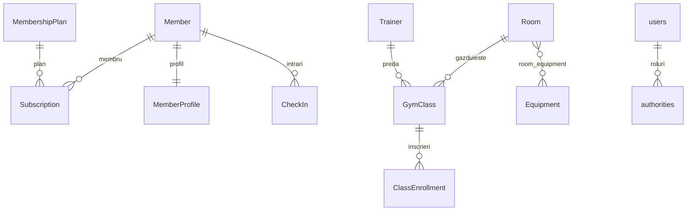

# Sistem de Management Sala de Fitness

Aplicatie web pentru gestionarea unei sali de fitness: membri, abonamente, antrenori, clase de grup, inscrieri si check-in.

Arhitectura de **microservicii** (migrata dintr-un monolit Spring Boot): configurare centralizata, service discovery si comunicare inter-servicii prin REST (OpenFeign).

## Stack Tehnologic

| Strat | Tehnologie |
|-------|------------|
| Baza de date | MySQL 8 (cate o schema per serviciu) |
| Backend | Java 21, Spring Boot 3.3, Spring Data JPA, Flyway, Spring Security |
| Cloud / Microservicii | Spring Cloud Config, Netflix Eureka, OpenFeign |
| Frontend | React 18 + Vite |
| Documentatie API | springdoc-openapi (Swagger UI) |
| Infrastructura locala | Docker Compose |

## Arhitectura

```text
                       ┌──────────────────┐
                       │  config-server   │  :8888  (Spring Cloud Config)
                       └────────┬─────────┘
                                │ configuratii
              ┌─────────────────┼─────────────────┐
              ▼                 ▼                 ▼
      ┌──────────────┐  ┌──────────────┐  ┌─────────────────────┐
      │ user-service │  │ gym-service  │  │ notification-service│
      │    :8081     │  │    :8082     │  │       :8083         │
      └──────┬───────┘  └──────┬───────┘  └──────────┬──────────┘
             │  Feign ↔ Feign  │      Feign (rapoarte)│
             └────────┬────────┴──────────────────────┘
                      ▼
              ┌──────────────┐
              │ eureka-server│  :8761  (Service Discovery)
              └──────────────┘

   Frontend (React/Vite :5173) ──proxy──► serviciile potrivite
```

## Componente

| Componenta | Port | Rol |
|------------|------|-----|
| config-server | 8888 | Spring Cloud Config Server — serveste configuratiile tuturor serviciilor |
| eureka-server | 8761 | Netflix Eureka — service registry, descoperire automata |
| user-service | 8081 | Autentificare (Spring Security JDBC), membri, profiluri, planuri, abonamente |
| gym-service | 8082 | Antrenori, sali, echipament, clase, inscrieri, check-in |
| notification-service | 8083 | Rapoarte agregate (apeluri Feign catre user-service + gym-service) |
| frontend | 5173 | UI React; proxy Vite ruteaza catre serviciul corect |

## Structura Proiect

```text
fitness-gym-system/
├── config-server/          # Spring Cloud Config (:8888)
│   └── src/main/resources/config/   # config per serviciu
├── eureka-server/          # Eureka Discovery (:8761)
├── user-service/           # :8081  — securitate + membri/abonamente
├── gym-service/            # :8082  — clase/traineri/sali/check-in
├── notification-service/   # :8083  — rapoarte (Feign)
├── frontend/               # React + Vite (:5173)
├── backend/                # monolitul original (referinta)
└── docker-compose.yml
```

## Configurare Centralizata (Spring Cloud Config)

- `config-server` serveste configuratiile din `config-server/src/main/resources/config/`.
- Fiecare serviciu citeste la startup: `spring.config.import: configserver:http://localhost:8888`.
- Externalizate: port, URL/credentiale baza de date, URL Eureka, cheie remember-me.
- Verificare: `http://localhost:8888/user-service/default`, `http://localhost:8888/gym-service/default`.

## Service Discovery si Comunicare (Eureka + Feign)

- Toate serviciile se inregistreaza automat in Eureka (`http://localhost:8761`).
- **Comunicare inter-servicii prin REST (OpenFeign):**
  - `user-service → gym-service`: creare antrenor la inregistrare, creare clasa (trainer), inscriere la clasa.
  - `gym-service → user-service`: validare membru la inscriere / check-in (`/api/internal/members/{id}`).
  - `notification-service → user-service + gym-service`: agregare date pentru rapoarte.
- Endpoint-uri interne (`/api/internal/**`) — fara autentificare, dedicate apelurilor inter-servicii.

## Baza de Date (Flyway, schema per serviciu)

| Serviciu | Schema | Migrari |
|----------|--------|---------|
| user-service | `user_service_db` | V1 schema, V2 securitate (`users`/`authorities`/`persistent_logins`), V3 seed |
| gym-service | `gym_service_db` | V1 schema (fara FK cross-service), V2 seed |

> Referintele cross-service (ex. `member_id` in `class_enrollment`/`check_in`) sunt stocate ca `Long` simplu, fara FK intre scheme — granita corecta intre microservicii.

## Model ERD



Relatii JPA:
- `@OneToOne`: `Member` ↔ `MemberProfile` (user-service).
- `@OneToMany`/`@ManyToOne`: `Member`/`MembershipPlan` → `Subscription` (user-service); `Trainer`/`Room` → `GymClass`, `GymClass` → `ClassEnrollment` (gym-service).
- `@ManyToMany`: `Room` ↔ `Equipment` prin `room_equipment` (gym-service).

## Securitate (Spring Security — user-service)

- Autentificare **JDBC** (`JdbcUserDetailsManager`), parole **BCrypt**.
- Roluri: `ROLE_USER`, `ROLE_ADMIN` (`admin` are ambele; `user` doar `ROLE_USER`).
- Autorizare `/api/**`: **GET** → USER sau ADMIN; **POST/PUT/DELETE** → doar ADMIN.
- `/api/internal/**` → permis (apeluri inter-servicii).
- Login form (`/login`), logout, remember-me persistent, CSRF (cookie `XSRF-TOKEN`).
- Conturi demo: `admin` / `Admin123!`, `user` / `User123!`.

## API REST

| Resursa | Serviciu | Path |
|---------|----------|------|
| Membri | user-service | `/api/members` |
| Profil membru (1:1) | user-service | `/api/member-profiles` |
| Planuri abonament | user-service | `/api/membership-plans` |
| Abonamente | user-service | `/api/subscriptions` |
| Autentificare / cont | user-service | `/api/auth/**` |
| Antrenori | gym-service | `/api/trainers` |
| Echipament | gym-service | `/api/equipment` |
| Sali (M:N echipament) | gym-service | `/api/rooms` |
| Clase | gym-service | `/api/gym-classes` |
| Inscrieri la clasa | gym-service | `/api/class-enrollments` |
| Check-in | gym-service | `/api/check-ins` |
| Rapoarte agregate | notification-service | `/api/reports/{members,subscriptions,classes,check-ins}` |

`DELETE /api/members/{id}` — dezactivare logica (`is_active = false`).

## Rulare Locala

### 1) Baza de date (MySQL pe 3306)

Creeaza schemele si userul:

```sql
CREATE DATABASE user_service_db;
CREATE DATABASE gym_service_db;
CREATE USER 'gym_user'@'localhost' IDENTIFIED BY 'gym_pass';
GRANT ALL PRIVILEGES ON user_service_db.* TO 'gym_user'@'localhost';
GRANT ALL PRIVILEGES ON gym_service_db.* TO 'gym_user'@'localhost';
FLUSH PRIVILEGES;
```

### 2) Pornire servicii (in aceasta ordine)

```text
1. config-server         (:8888)
2. eureka-server         (:8761)
3. user-service          (:8081)
4. gym-service           (:8082)
5. notification-service  (:8083)
```

Fiecare: ruleaza clasa `*Application` din IntelliJ. Flyway aplica migrarile la startup.

### 3) Frontend

```bash
cd frontend
npm install
npm run dev
```

Deschide `http://localhost:5173` si autentifica-te cu `admin` / `Admin123!`.

## Verificare

- Eureka dashboard: `http://localhost:8761` — trebuie sa apara USER-SERVICE, GYM-SERVICE, NOTIFICATION-SERVICE.
- Config server: `http://localhost:8888/user-service/default`.
- Test Feign (raport agregat): `http://localhost:8083/api/reports/members`.

## Note despre alternativa Docker

`docker-compose.yml` porneste intregul stack (MySQL + cele 5 servicii) acolo unde virtualizarea este disponibila. Pe masinile fara suport de virtualizare, foloseste MySQL instalat local + pornirea serviciilor din IDE (vezi mai sus).
